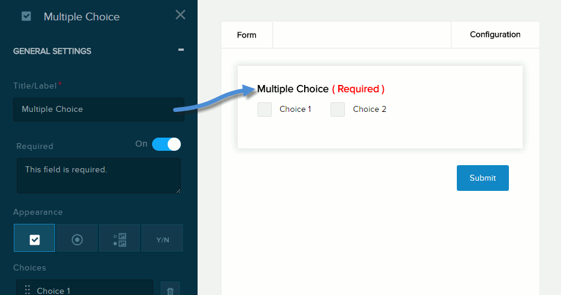
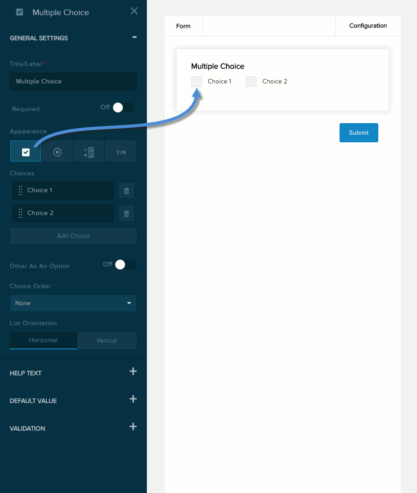
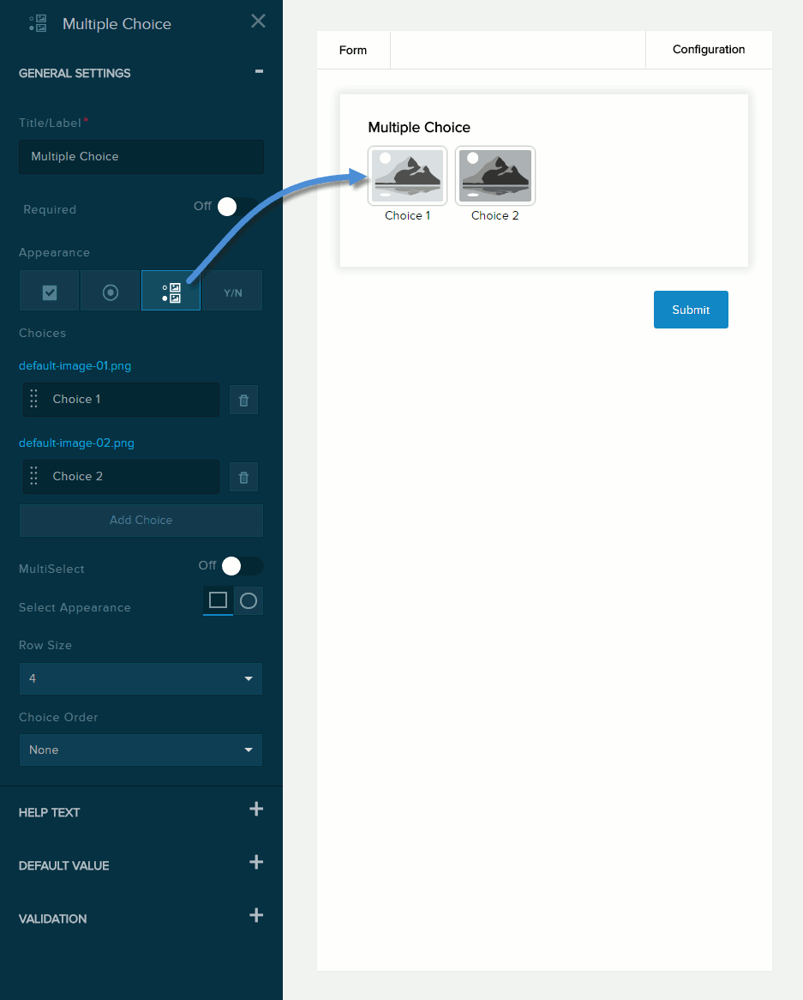
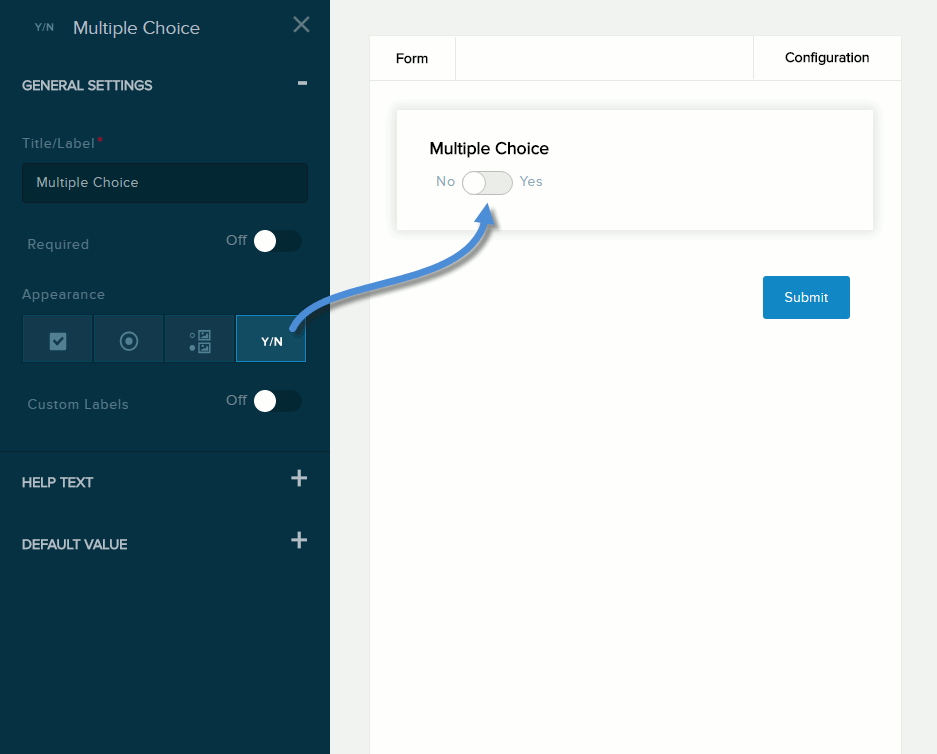
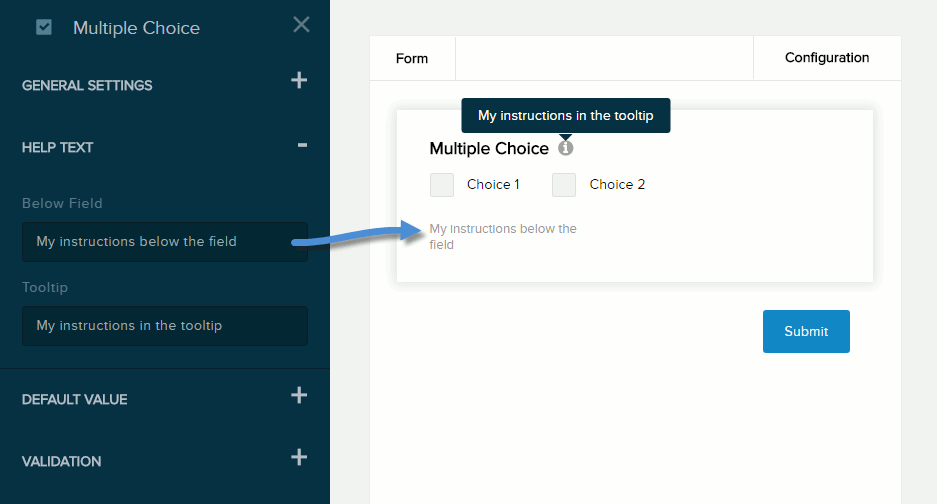
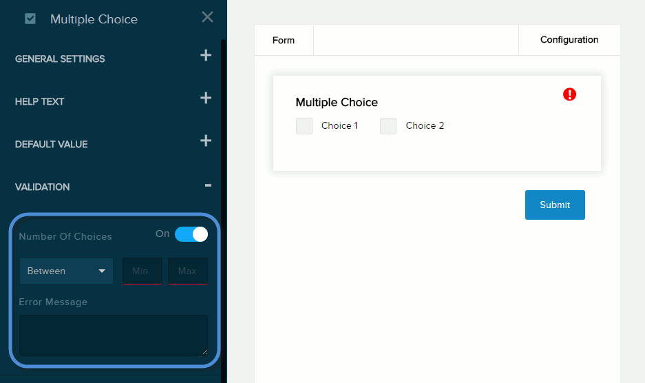

# Form Field: Multiple Choice

## General Settings

  

  

Field

Description

Title/Label

Name of the field. You can change the name either in the General Settings panel or directly above the field on the canvas.

Required

If enabled (On),

*   The field name is marked as required.
*   The message you enter in the provided text box will be displayed if the user does not provide a value in the field.

  

  

Field

Description

Appearance

*   Checkboxes. Allows multiple selections.
*   Radio Buttons. Allows only one selection.
*   Images. Displays the images you specify as the choices. You can choose whether to allow multiple selections or to allow only one.
*   Yes/No. Offers two choices, whose labels can be customized.

  

  

Field

Description

Choices

The list of options.

*   To add an option, click/tap Add Choice and enter the option label in the text field.
*   To edit an option, click/tap an existing option and edit its label.
*   To delete an option, click/tap the trash icon next to it.
*   To rearrange the order of the options, drag and drop each option to a new position in the list.

Other As An Option

If enabled (On), the user can enter a custom option in the text box and choose that option.

Choice Order

*   None
*   Alphabetically
*   Randomized

List Orientation

*   Horizontal. Displays the options left-to-right and wraps to the next line.
*   Vertical. Displays the options, one per line.

  

  

Field

Description

Multiselect

If enabled (On), the user can choose one or more options.

Select Appearance

The shape of the images: square or circle.

Row Size

The number of images displayed in each row.

  

  

Field

Description

Custom Labels

If enabled (On), you can replace the default No and Yes labels with the text you enter in the No Label and Yes Label fields, respectively.

## Help Text

  

  

Field

Description

Below Field

Help text to be displayed below the field. Maximum length: 140 characters.

Tooltip

If enabled (On) and the user hovers/clicks/taps over the information icon (i) next to the field name, displays the help text you enter in the provided text box. Maximum length: 140 characters.

## Default Value

  

  

Field

Description

Default Value

The value to assign to the field if the user does not provide a custom value.

## Validation

  

  

Field

Description

Number of Choices

If enabled (On), the message you enter in the provided text box will be displayed if the user provides a value outside the valid range. You must indicate the valid range:

*   Minimum. The valid range is from the value you enter in Min to infinity.
*   Maximum. The valid range is from infinity to the value you enter in Max.
*   Between. The valid range is from the value you enter in Min to the value you enter in Max.

Min must be less than Max.

Error Message

The message to display if the user entered data that does not meet the requirements for the field.