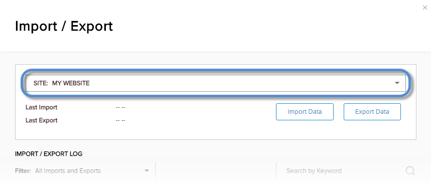
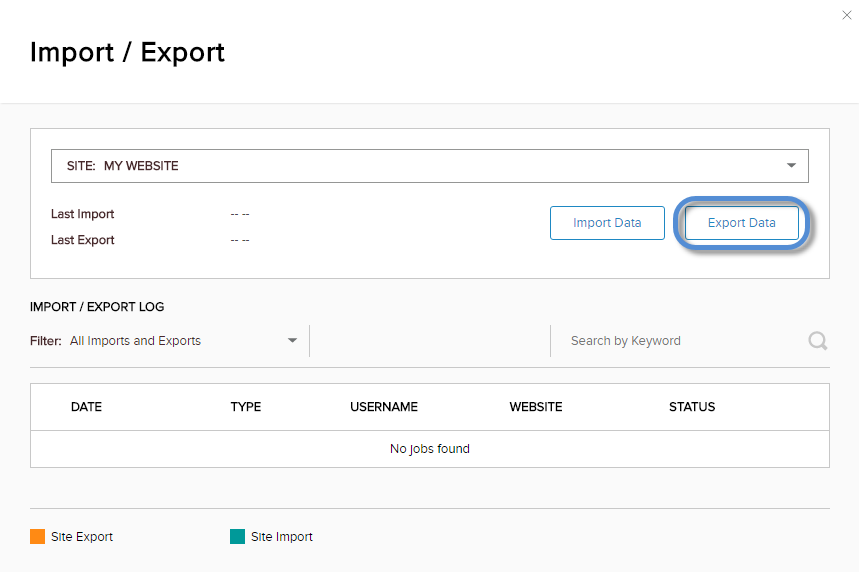
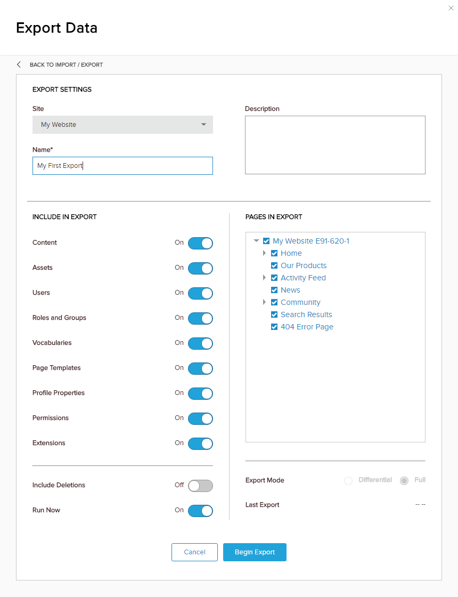

# Export a Site

Note: An export can take time depending on the selected components and the size of the site.

## Prerequisites

*   **A host / super user account.** Hosts have full permissions to all sites in the DNN instance.

## Steps

1.  Go to Persona Bar \> Settings \> Import-Export.
    
    
    
    ➊
    
    ➋
    
2.  Choose a site to export from.
    
      
    
    
    
      
    
3.  Click/Tap the Export Data button.
    
      
    
    
    
      
    
4.  Configure the export settings.
    
      
    
    
    
      
    
    Field
    
    Description
    
    Name
    
    A user-friendly name to refer to the export.
    
    Include in Export
    
    The components to export.
    
    Pages in Export
    
    The pages to export.
    
    Include Deletions
    
    If enabled (On), Recycle Bin items are exported.
    
    Note: These items are not imported into a Production installation.
    
    Run Now
    
    If enabled (On), the process starts immediately.
    
    Export Mode
    
    *   Differential. Exports only the differences between the last export and the current state.
    *   Full. Exports the selected components and pages fully.
        
        Note: The first export is always a full export.
        
    
5.  Click/Tap Begin Export.

## What to do next

Check the Import / Export Log for the status of the export.