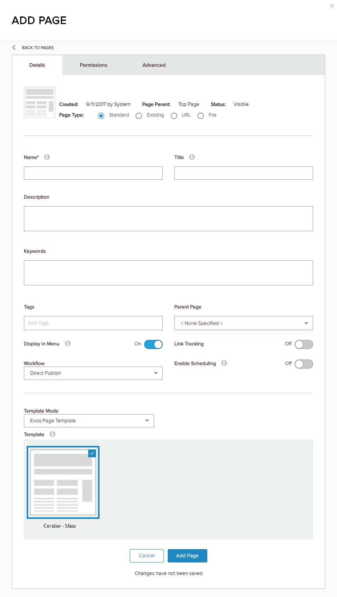

# Configure a Standard Page

## Steps

1.  Go to Persona Bar \> Content \> Pages.
    
    
    
    ➊
    
    ➋
    
2.  In the Pages page, hover over the page to configure, then click/tap the gear icon.
    
      
    
    
    
      
    
3.  In the Details tab, configure the basic settings of the page.
    1.  Set Page Type to Standard.
        
        
        
    2.  Configure the new standard page.
        
          
        
        
        
          
        
        Field
        
        Description
        
        \[Page\] Name
        
        Required. Used in the navigation.
        
        \[Page\] Title
        
        Displayed as the browser window's title.
        
        Tip: The title is used by search engines to identify the information on the page. Include at least five highly descriptive words, and keep the title under 200 characters.
        
        \[Page\] Description
        
        Information about the page.
        
        Keywords
        
        Comma-separated keywords that can be used by search engines to help index your site's pages.
        
        Tags
        
        Predefined tags that you can choose from the dropdown, if any are defined in the Taxonomy Manager.
        
        Parent Page
        
        Branch Parent
        
        The page under which the new page(s) should reside in the hierarchy.
        
        Display in Menu
        
        If enabled, the page is included in the main navigation menu. If the page is not included in the navigation menu, you can still link to it using its URL.
        
        Link Tracking
        
        If enabled, tracking links are created to determine where traffic to the page is coming from.
        
        Workflow
        
        Predefined workflow states that you can choose from the dropdown.
        
        Enable Scheduling
        
        If enabled, the Start Date and End Date buttons appear below the switch. Click/Tap on either button to set the time span when the page is publicly visible on the site.
        
        *   The page is published after the specified start date. If Start Date is not set, the page is published immediately.
        *   The page is hidden after the specified end date. If End Date is not set, the page is visible indefinitely.
        
          
        
        
        
          
        
        Template Mode
        
        *   Import from Xml. You must specify an XML file containing the template to import.
        *   Evoq Page Template. You must choose from the template layouts provided by the site's current theme.
        
        Page Template
        
        The template layouts are defined by the theme used in the site.
        
        Xml File
        
        The XML file containing the template to import.
        
4.  (Optional) In the Permissions tab, configure which roles can do which actions on this page.
    
      
    
    
    
      
    
    *   Assign permissions for each role. Under Permissions by Role,
        *   To filter the displayed roles, select the role group from the Filter By Group dropdown.
        *   To add another role to the list, choose the additional role from the Select Role dropdown, and click/tap Add.
        *   Check the appropriate checkboxes to enable each role to perform actions.
    *   Assign permissions for a specific person. Under Permissions by User,
        *   To add a specific user to the list, enter part of their display name, select the correct user from the list, and click/tap Add.
        *   Check the appropriate checkboxes to enable each role to perform actions.
    
5.  (Optional) In the Advanced tab, configure additional settings.
    1.  In the Modules subtab, edit or delete the modules on the page, as needed.
        
          
        
        
        
          
        
        Note: The Modules tab appears only if configuring a standard page.
        
    2.  In the Appearance subtab, configure how the page is displayed.
        
          
        
        
        
          
        
        Field
        
        Description
        
        Page Theme
        
        The theme to use for the page.
        
        Layout
        
        The layout to use for the page.
        
        Page Container
        
        The container to use for all modules in the page. This setting is overridden by the module's container setting, if any.
        
        Page Stylesheet
        
        The CSS to use for this page. If blank, a default CSS is used. (Note: The default CSS used depends on other settings; it might be from the page theme, the site theme, or other CSS defaults.)
        
        Preview Theme Layout and Container
        
        If clicked/tapped, all the selected Appearance settings are applied to a page in a new browser window or tab.
        
    3.  In the SEO subtab, configure SEO-related settings for the page.
        
          
        
        
        
          
        
        Field
        
        Description
        
        Page Header Tags
        
        HTML `<meta>` tags to add to the `<head>` of the page. Example: `<meta name="keywords" content="CMS, Liquid Content, example">`
        
        Sitemap Priority
        
        The priority for the page (0 to 1.0; default is 0.5). This value helps search engines to rank the page relative to other pages in the site.
        
        Allow Indexing
        
        If enabled (On), the `ROBOTS` meta tag is set to `INDEX` to indicate that search engines should index the page; i.e., `<meta name="ROBOTS" content="INDEX" />`. Otherwise, the `ROBOTS` meta tag is set to `NOINDEX`, and search engines ignore the page.
        
    4.  In the More subtab, configure security and caching for the page.
        
          
        
        
        
          
        
        Field
        
        Description
        
        Secure Connection
        
        If enabled (On), the page is forced to use SSL. Available only if the site is SSL-enabled.
        
        Disable Page
        
        If enabled (On), the page appears in the navigation, but it cannot be clicked/tapped, thus creating a placeholder.
        
        Output Cache Provider
        
        The caching provider to use for the page. If none is specified, the site's caching provider is used.
        
6.  Click/Tap Save.

## Results

The page is displayed in edit mode. You can click/tap on any of the panes to add content or modules.