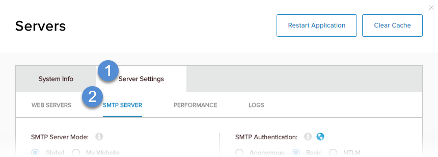
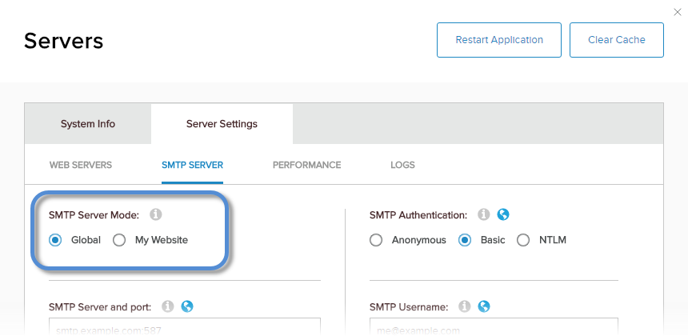
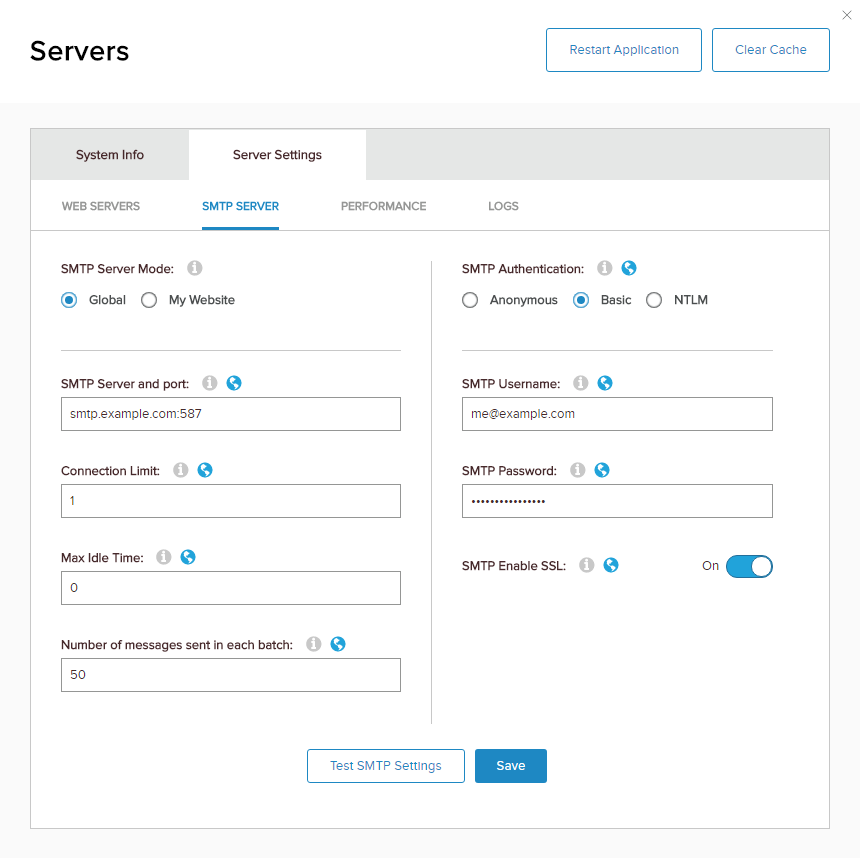

# Configure the SMTP Server

## Prerequisites

*   **A host / super user account.** Hosts have full permissions to all sites in the DNN instance.

## Steps

1.  Go to Persona Bar \> Settings \> Servers.
    
    
    
    ➊
    
    ➋
    
2.  Go to the Server Settings tab, and then the SMTP Server subtab.
    
    
    
3.  Choose the scope of the settings.
    
    *   Global. Applies the SMTP settings to all sites in the installation.
    *   The name of the current site. Applies the SMTP settings only to the current site.
    
      
    
    
    
      
    
4.  Configure the settings.
    
      
    
    
    
      
    
    Field
    
    Description
    
    SMTP Server and Port
    
    The SMTP server and port to use for sending emails (e.g., smtp.example.com or smtp.example.com:25).
    
    Connection Limit
    
    The maximum number of concurrent connections with the SMTP server.
    
    Max Idle Time
    
    The maximum number of milliseconds that a connection is allowed to be idle before the it is closed.
    
    Number of Messages Sent in Each Batch
    
    The number of messages sent by the messaging scheduler in each batch.
    
    Important: If your SMTP server throttles messages to regulate the flow of messages, set this number to be less than the SMTP server's maximum number of messages per batch.
    
    SMTP Authentication
    
    *   Anonymous. No authentication is used.
    *   Basic. User names and passwords are sent across the network as plain text.
    *   NTLM. The NT LAN Manager is used for authentication.
    
    SMTP Username  
    SMTP Password
    
    The username and password for the account used to send email messages (e.g., myusername@example.com). Only required if SMTP Authentication is set to Basic.
    
    SMTP Enable SSL
    
    (Optional) If enabled (On), a secure connection is used when communicating with the SMTP server.
    
5.  (Optional) Click/Tap Test SMTP Settings to confirm that you can connect to the SMTP server with the current settings.
6.  Save.