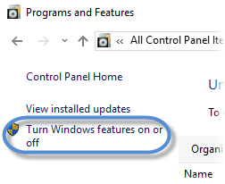
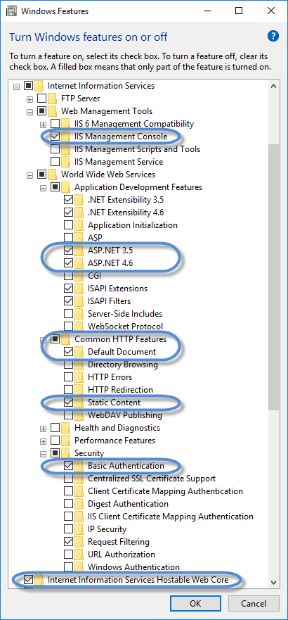
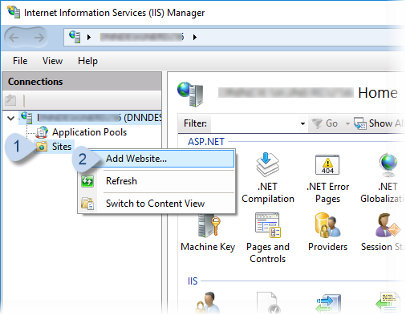
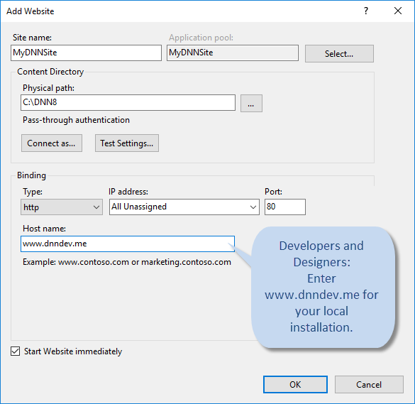
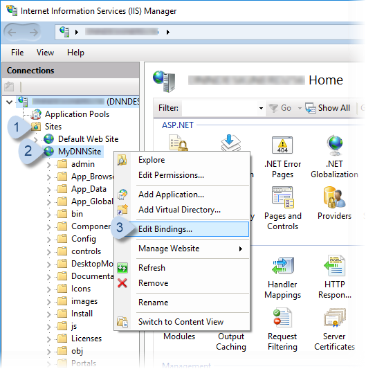
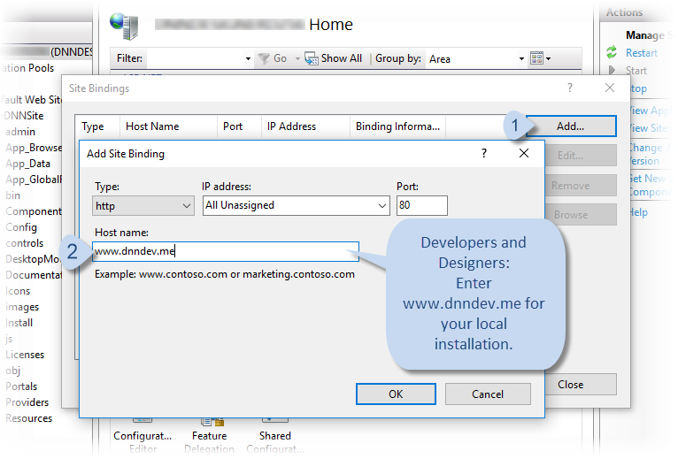

# Enable and Set Up IIS

## Prerequisites

[DNN installed with folder permissions for the user account that will run your website.](set-up-dnn-folder)

## Steps

1.  Enable IIS.
    1.  [Check compatible versions.](requirements)
    2.  Go to Control Panel \> Programs and Features \> Turn Windows features on or off.
        
          
        
        
        
          
        
    3.  Under Internet Information Services, turn on the following:
        
        *   Web Management Tools: IIS Management Console
        *   World Wide Web Services
            *   Application Development Features: ASP.NET 3.5 and 4.6
            *   Common HTTP Features: Default Document and Static Content
            *   (Optional) Security: Basic Authentication
        *   Internet Information Services Hostable Web Core
        
          
        
        
        
          
        

You can create a new website or set up an existing one for use with DNN. Choose one of the next two steps.

2.  To create a new website and point it to the DNN installation folder:
    1.  Go to Control Panel \> Administrative Tools \> Internet Information Services (IIS) Manager.
    2.  In the Connections panel, expand your host tree, right-click on Sites, and choose Add Website.
        
          
        
        
        
          
        
    3.  Enter the new website's name and choose the location.
        
          
        
        
        
          
        
    4.  Enter the Host name.
        
        Developers and Designers: If setting up a local development environment, you can use `www.dnndev.me` (or any subdomain). DNNDEV.ME is a registered domain which points to the loopback address of 127.0.0.1, so it will always resolve locally.
        
        Administrators: If setting up a live website, use your website's domain.
        
          
        
        
        
          
        
3.  To use an existing IIS website:
    1.  In the Connections panel, right-click on the name of the existing website, and choose Edit Bindings....
        
          
        
        
        
          
        
    2.  In Site Bindings, click/tap Add.... In Add Site Binding, enter the Host name.
        
        Developers and Designers: If setting up a local development environment, you can use `www.dnndev.me` (or any subdomain). DNNDEV.ME is a registered domain which points to the loopback address of 127.0.0.1, so it will always resolve locally.
        
        Administrators: If setting up a live website, use your website's domain.
        
          
        
        
        
          
        
4.  If you do not use **NETWORK SERVICE** as the user account to run your website, verify that **IIS AppPool\\AppPoolName** has **Full** or **Modify** permissions for the DNN installation folder.
    
    The account **IIS AppPool\\AppPoolName** is automatically created by IIS.
    
    See [Set Up DNN Folder and the User Account](set-up-dnn-folder).