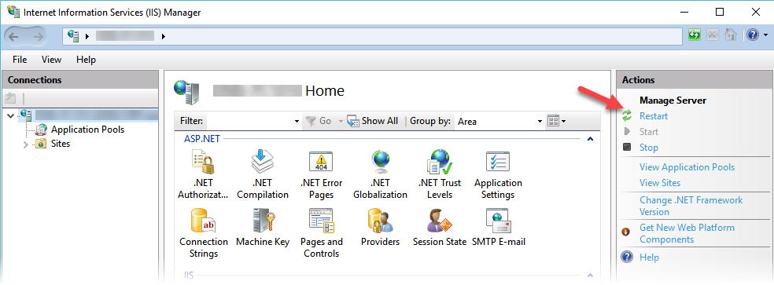

# Move Site To Another Server

## Steps

Export the web files from the old server, and set up the site in the new server.

1.  [In the old server, export the site.](export-site)
2.  [Copy the export package to the new server.](transfer-an-export-package)
3.  [In the new server, import the site using the export package.](import-site)
4.  [In the new server, create a new IIS site.](set-up-iis)
5.  [Add the necessary permissions for your website folder.](set-up-dnn-folder)

Copy the database and set up a database user.

6.  [In the old server, back up the database to a .bak file, then copy the .bak file to the new server.](https://docs.microsoft.com/en-us/sql/relational-databases/backup-restore/create-a-full-database-backup-sql-server)
7.  [In the new server, restore the SQL database.](https://docs.microsoft.com/en-us/sql/relational-databases/backup-restore/restore-a-database-backup-using-ssms)
8.  In the new server, use SQL Server Management Studio to set up a database user.
    1.  [Create a new user for your database.](set-up-sql#tsk-set-up-sql__set-up-sql-user)
    2.  [Set up the appropriate permissions.](set-up-sql#tsk-set-up-sql__db-owner-access)

Configure web.config and the crawl list.

9.  In the new server, [access the web.config file](access-web-config), and verify that the `connectionStrings` section is correctly configured.
    
    *   `Data Source` must be set to the path to your database server.
    *   `Catalog` must be the name of the database you restored.
    *   `User ID and Password` must be the credentials of the authorized user that you created for your database.
    *   `Data Source` must be set to the path to your database server.
    
10.  If the web address for the new site is different from the old site, [update the starting URL for crawling](edit-starting-url-in-crawl-list).

Clear cache and restart.

11.  In IIS Manager, restart your website.
    1.  Go to Control Panel \> Administrative Tools \> Internet Information Services (IIS) Manager.
    2.  In the Actions panel on the right, click/tap Manage Server \> Restart.
        
          
        
        
        
          
        
        Tip: Remember to update your DNS with your new server’s IP address.
        
12.  [Clear the DNN cache.](clear-cache)
13.  [Restart the DNN application.](restart-application)